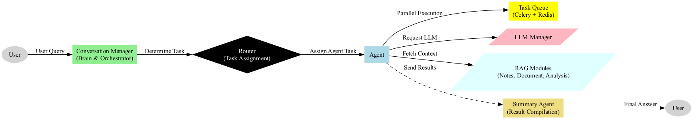

# Modular-LLM-Architecture
**Exploring the cognitive architecture and design of a multi-agent system leveraging Large Language Models (LLMs) for scalable workflows.**

## Architecture Diagram

The diagram illustrates the key components of the system, including the Conversation Manager, Router, LLM Manager, and specialized agents.

---

## Core Features
- Modular multi-agent design.
- Dynamic LLM integration with support for multiple models.
- Separation of concerns for improved maintainability.

---
### Introduction

In the era of Large Language Models (LLMs), designing systems that handle diverse tasks with scalability and flexibility is a growing challenge. The cognitive architecture presented here leverages modular design principles to build a robust multi-agent system, featuring clear separation of responsibilities and dynamic LLM integration. This blog explores the architectural details, using the attached diagram as a guide.

---

### Core Components of the Architecture

1. **Conversation Manager (Brain and Orchestrator):**
   - The central "brain" of the system. It processes user inputs and orchestrates tasks by delegating them to specialized agents through the **Router**.
   - Maintains state for multi-step conversations, ensuring continuity and coherence.

2. **Router (Task Assignment):**
   - A lightweight component that assigns tasks to the appropriate agent based on their expertise.
   - Decouples task routing from task execution for better maintainability.

3. **LLMManager (Flexible LLM Integration):**
   - Centralizes interaction with LLMs, enabling seamless integration of multiple models.
   - Supports dynamic model selection and configuration changes, such as adjusting temperature or choosing specific LLMs for tasks.
   - Ideas for caching and small-model fallback mechanisms have been proposed but are not yet implemented.

### Specialized Agents

Each agent is designed with a specific role, ensuring a clear separation of concerns:

- **SQL Agent (Natural Language to SQL):** Converts user prompts into SQL queries, currently interacting with the **Database Schema via prompt injection** to fetch metadata. In production, this will transition to a graph-based Retrieval-Augmented Generation (RAG) system for enhanced flexibility and scalability.

- **SQL Debugging Agent:** Debugs and corrects SQL queries, ensuring accurate execution. It refines queries up to three times, addressing issues like spelling errors or incomplete logic, to ensure meaningful outputs.

- **Analyser Agent (Data Analysis):** Analyzes structured or unstructured data to provide insights. Future enhancements include integrating LLM results with business data from platforms like Slack, Microsoft Teams, and OneDrive.

- **Charting Agent:** Writes Vega specifications for data visualization.
- **Vega Debugging Agent:** Corrects and validates Vega JSON specifications for accurate visual rendering.
- **Knowledge Agent:** Retrieves answers from document repositories, relying on the **Document RAG** for context. It addresses business-specific queries like defining terms such as 'churn' at Peacock, ensuring concise and clear summaries.
- **Follow-Up Agent:** Engages with users to provide iterative feedback and refine responses. It also suggests 2-3 similar analyses to help users explore related questions.
- **Clarification Agent:** Ensures the highest level of accuracy by detecting ambiguity and prompting for clarification. For instance, it can inquire, "What do you consider a top show? Should it be based on total hours viewed, other metrics, or specific time periods like a calendar month?"
- **Note Agent:** Streamlines analyses by capturing preferences like focusing on Android devices in New York state. This eliminates repetitive specifications, ensuring appropriate SQL queries and tailored visualizations.

- **Summary Agent (Result Compilation):** Summarizes outputs from various agents, compiling user-friendly reports. It always runs at the end, providing concise summaries to ensure clarity.

---

### Key Features of the Design

1. **Modularity and Maintainability:**
   - Each component focuses on a single responsibility, improving maintainability and scalability.
   - The **Router** and **Conversation Manager** allow seamless integration of new agents.

2. **Flexible LLM Integration:**
   - The **LLMManager** supports a plug-and-play approach, enabling dynamic LLM selection.
   - Designed for integration with vector databases and embedding techniques for advanced retrieval functionalities.

3. **Separation of Concerns:**
   - Clear division of tasks between routing, orchestration, and execution layers prevents overlap and reduces complexity.

4. **Resilience:**
   - Built-in mechanisms for retries, error handling, and debugging ensure reliable performance under diverse scenarios.

---

### Workflow in Action

1. **User Input:** The **Conversation Manager** receives a query, such as "What are the top 5 most viewed shows across all regions?"
2. **Routing:** The **Router** assigns the task to the **SQL Agent**. Before this step, the **Clarification Agent** intervenes to detect ambiguity and refines the user’s intent by asking up to three questions.
3. **LLM and Database Integration:** The **SQL Agent** interacts with the **LLMManager** to generate a SQL query, retrieves metadata from the **Database Schema**, and sends the query to the **Query Executer**.
4. **Validation and Debugging:** If the SQL Agent encounters challenges like errors or empty results, the **SQL Debugging Agent** provides assistance, refining the query as needed.
5. **Visualization:** The **Vega Agent** generates a JSON specification for visualization, enabling insightful and interactive outputs.
6. **Summarization:** The **Summary Agent** compiles findings into concise reports, limited to three sentences for clarity.
7. **Follow-Up:** The **Follow-Up Agent** recommends 2-3 similar analyses to assist users in exploring related questions.

---

### Real-World Applications

- **Business Intelligence (BI):** Generating dynamic dashboards and actionable insights from natural language queries.
- **Data Exploration:** Allowing non-technical users to interact with databases intuitively.
- **Knowledge Management:** Streamlining access to enterprise knowledge repositories.

---

### Challenges and Future Directions

- **Scalability:** Ensuring the system scales effectively with increasing user demands.
- **Security:** Safeguarding sensitive data by leveraging open-source and small models where feasible to minimize exposure.
- **Agent Expansion:** Adding more specialized agents for domain-specific tasks.

---

### Conclusion

This cognitive architecture highlights the strengths of modular design and multi-agent systems in effectively utilizing LLMs for complex workflows. By integrating flexible LLM capabilities and maintaining a clear separation of responsibilities, it establishes a robust framework for building scalable and efficient AI-driven solutions.

---

### Suggestions for Moving Forward

1. **Enhanced Task Queue Features:** Implement advanced parallelism techniques and error recovery using task retry logic for more resilient execution.
2. **Enhanced Agent Collaboration:** Introduce inter-agent communication protocols to improve collaboration and reduce redundant processing.
3. **Observation and Evaluation Tools:** Incorporate tools like Arize.ai or LangSmith to monitor and evaluate system performance.
4. **Dynamic Feedback Mechanisms:** Implement advanced user feedback loops to refine agent outputs in real time.
5. **Agent Response Evaluation:** Integrate solutions like Galileo or similar platforms to evaluate the performance of agent responses for comprehensive insights.
6. **Memory Enhancements:** Use tools like LangGraph to improve system memory and context recall.
7. **Scalability Optimization:** Focus on performance for large-scale deployments, leveraging platforms like Predibase for enhanced scalability and adaptability.

